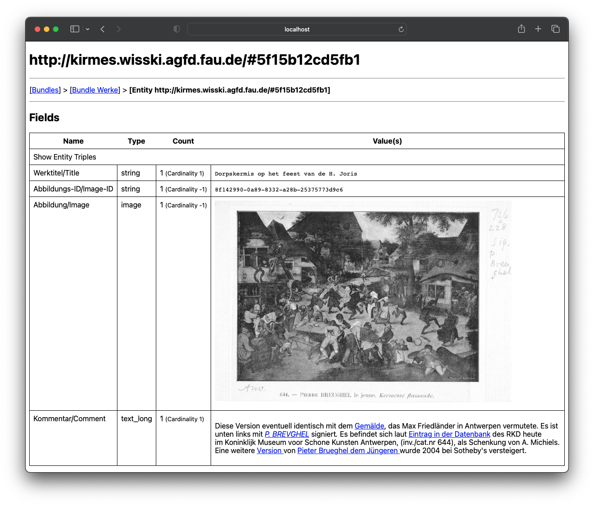

# Hangover - A WissKI Data Viewer


<!-- spellchecker:words nquad CORDI nquads kirmes drincw -->

[](https://github.com/FAU-CDI/hangover/actions/workflows/go.yml)

[WissKI](https://wiss-ki.eu/) is a software that allows researchers to record data about (objects of) cultural heritage in a graph database backed by a formal ontology.
WissKI acts as a database for researchers to store their results via a web interface, and nearly automatically makes data FAIR, linked and open.

WissKI data typically consists of two parts.
The data itself is stored as triples inside a graph database, and is typically exported in `.nq` format.
The metadata and description are stored inside a so-called [Pathbuilder](https://wiss-ki.eu/documentation/data-modeling/pathbuilder).
These parts are typically exported on a regular basis for both backup and archival purposes. 

Unfortunately there is a cognative impedance mismatch between the data stored in the graph database and the data entered in the WissKI interface. 
The triples may contain the information displayed in WissKI, but in order to properly understand them the pathbuilder, typically available only in WissKI, is required. 
This becomes a problem when you take into account that installing, maintaining, and running a WissKI-based system itself is a complex progress, and requires a system administrator with significant technical expertise.

After a research project using a WissKI ends, and funding has run out, the WissKI installation quickly ends up in an unusable state or is shutdown entirely.
Only the archival exports of the system data still exist. 

This repository contains `hangover` - the WissKI Data Viewer.
It directly provides the researcher with an interface to view any database entries created in the originating system.
The viewer runs directly on the researchers' computer and requires only the triplestore export (in nquad `.nq` format) and the pathbuilder export (in `.xml` format).

### Demo and Bibliography



A [Demo](https://wisskiviewer.kwarc.info/) is available.
You can also
[see this object in the demo](https://wisskiviewer.kwarc.info/entity/objekt?uri=http%3a%2f%2fkirmes.wisski.agfd.fau.de%2f%235f15b12cd5fb1).


A further high-level overview can be found in:
- [CORDI 2023 Extended Abstract](./docs/cordi-2023-ea.pdf)
- [CORDI 2023 Poster](./docs/cordi-2023-poster.pdf)

## Repository Overview

This repository contains three executables, [hangover](#hangover---a-wisski-data-viewer),  [n2j](#n2j---a-wisski-exporter) and [headache](#)
They are described in detail below.

## Installation

### from source

1. Install [Go](https://go.dev/), Version 1.21 or newer
2. Optional: Install [Yarn](https://yarnpkg.com/) (if you're tweaking the frontend code)
3. Optional: Install [Fyne Dependencies](https://developer.fyne.io/started/#prerequisites) (if you're building the gui application)
3. Clone this repository somewhere.
4. Fetch dependencies:

```bash
make deps
```

5. Use the `Makefile` to build dependencies into the `dist` directory:

```bash
make all
```

5. Run the executables, either by placing them in your `$PATH` or telling your interpreter where they are directly.

As an alternative to steps 4 and 5, you may also run executables directly:

```bash
go run ./cmd/hangover arguments...
```

Replace `hangover` with the name of the executable you want to run.

### from a binary

We publish binaries for Mac, Linux and Windows for every release.
These can be found on the releases page on GitHub. 

### from docker

[](https://github.com/FAU-CDI/hangover/actions/workflows/docker.yml)

The `hangover` executable is available as the [https://github.com/FAU-CDI/hangover/pkgs/container/hangover] docker image.
It is automatically built after every commit.

It automatically starts hangover on port 3000.

To start it, use a command like:

```
docker run -ti --read-only -p 3000:3000 -v /path/to/wisski/export:/data:ro ghcr.io/fau-cdi/hangover:latest /data/
```

You can add any further hangover parameters as arguments.

## Usage

### hangover - A WissKI Data Viewer

The `hangover` executable implements the WissKI Data Viewer.
It is invoked with two parameters, the pathbuilder to a pathbuilder xml `xml` and triplestore `nquads` export.
It then starts up a server at `localhost:3000` by default.

For example:

```bash
hangover kirmes/kirmes.xml kirmes/kirmes.nq
```

If you have both the pathbuilder and triplestore exports in the same directory, and only one '.nq' and one '.xml' file exists in that directory, you can also just give the path to that directory:

```
hangover /kirmes/
```

It supports a various set of other options, which can be found using  `hangover -help`.
The most important ones are:

- `-html`, `-images`: Automatically display html and image content found within the WissKI export. By default, these are only displayed as text.
- `-public`: Set the _public URL_ this dump originates from, for example `https://wisski.example.com/`. This automatically finds all references to it within the data dump with references to the local viewer.
- `-cache`: By default all indexes of the dataset required by the viewer are constructed in main memory. This can take several gigabytes. Instead, you can specify a temporary directory to read and write temporary indexes from.
- `-export`: Index the entire dataset, then dump the export in binary into a file. Afterwards `hangover` can be invoked using only such a file (as opposed to a pathbuilder and triplestore export), skipping the indexing step. The file format may change between different builds of drincw and should be treated as a blackbox.

Futhermore, the viewer also provides some convenience options for deployment:
- `-footer`: Allows customizing the html to appear in the footer. 
- `-strict-csp`: Adds a stricter [`Content-Security-Policy`](https://developer.mozilla.org/en-US/docs/Web/HTTP/CSP) header that only allows external images and audio from the `public` uris to load, but nothing else.
- `tipsy`: Allows embedding the current pathbuilder into [TIPSY](https://github.com/tkw1536/TIPSY). Provide the URL of the TIPSY instance to embed, e.g. `https://tipsy.guys.wtf`.

#### n2j - A WissKI Exporter

n2j stands for `NQuads 2 JSON` and can convert a WissKI export into json (or more general, relational) format.
Like `hangover`, it takes both a pathbuilder and export as an argument.
By default, it produces a single `.json` file on standard output.

Further options supports a various set of other options, which can be found using  `n2j -help`.

#### headache - A Hangover GUI

Headache is a GUI on top of hangover.

(work in progress)


## Development

During development standard go tools are used.
Commands can be found in `./cmd/`.
Packages are documented and tested where applicable. 

Some files are generated, in particular the legal notices and frontend assets.
This requires some external tools written in go.
The frontend assets furthermore require node packages to be installed using [yarn](https://yarnpkg.com/).

A Makefile exists to simply the setup on a fresh system.
To install all (go) dependencies required for a build, run `make deps`.
To regenerate all assets, run `make generate`.
To build the `dist` directory, run `make all`.

go executables remain buildable without installing external dependencies.

## License

Licensed under the terms of [AGPL 3.0](https://github.com/FAU-CDI/hangover/blob/main/LICENSE) for everyone.
Aditionally licensed under the terms of the standard GPL license, version 3, for internal usage at FAU-CDI only. 
